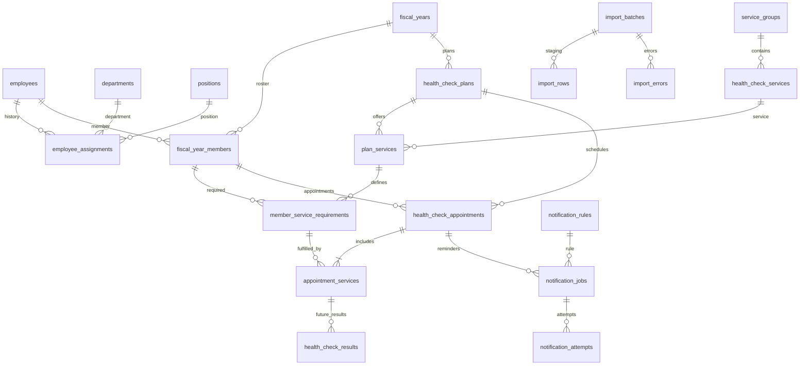

# สถาปัตยกรรมและฐานข้อมูลที่ใช้จริง

ระบบใหม่ใช้ Next.js App Router ทั้งหน้าเว็บและ Route Handlers บน Node.js ไม่มี Express API ซ้ำอีกชุด ส่วนงานแจ้งเตือนเป็น Node worker แยก process เพื่อทำงานต่อได้แม้ไม่มีใครเปิดหน้าเว็บ ใช้ MySQL/InnoDB, mysql2 prepared statements และ transaction จาก connection เดียวกัน

## แหล่งอ้างอิงและขอบเขต

- repo `Jacob-SSR/ppc-hos-10667` อ่าน SQL/query เท่านั้น ณ commit `e16908ce7609fda4a70b62a5832f642270e042bf` ไม่มีการแก้ไข เชื่อมเขียน หรือ migration เข้า schema เดิม
- `ppchos.users` เป็นบัญชีระบบเดิม ไม่ใช่ทะเบียนบุคลากร HR; ไม่คัดลอกรหัสผ่านหรือบัญชีมาใช้
- `doctor` เป็นผู้ให้บริการ ไม่ยืนยันว่าครอบคลุมบุคลากรทุกตำแหน่ง ส่วน `doctor_position` มีเพียงการอ้างใน comment จึงไม่สมมติชื่อ PK/FK
- `patient`, `person`, `oapp` เป็นบริบทผู้ป่วย/ประชากร/นัดผู้ป่วย ไม่ใช้แทนบุคลากรและนัดตรวจประจำปี
- query เดิมใช้แนวคิดปีงบประมาณได้ แต่ connection เดิมใช้ tis620; ระบบใหม่ใช้ utf8mb4 และฐานใหม่
- ไฟล์ตารางนัดที่ให้มามี 861 แถว / 183 ชื่อ แต่ไม่มี employee_code ที่ตรวจรับ จึงไม่จับคู่ชื่อหรือใส่รายชื่อจริงใน seed
- INFOMATION_PERSON ใช้ดูชื่อตำแหน่ง/หน่วยงานเท่านั้น เก็บเฉพาะรายการอ้างอิงใน [POSITION-REFERENCE.md](POSITION-REFERENCE.md) ไม่เพิ่มบุคคลหรือ master อัตโนมัติ
- SQL ที่ใช้ติดตั้งจริงคือ [001_core.sql](../database/migrations/001_core.sql) ไม่ใช่แบบร่างจากขั้นวิเคราะห์ ชื่อตารางและ API บางส่วนย่อให้ตรง implementation

## Lifecycle และกฎหลัก

1. หน้าแรกเป็นปฏิทินสาธารณะ (ข้อมูลรวมเท่านั้น) พร้อม Login ด้านขวาบน; Admin จัดการที่ /admin → นำเข้าบุคลากรพร้อม master จาก private seed → เปิดปี พ.ศ. (ระบบเตรียมบริการประจำ ทันตกรรม/แผนไทย/กายภาพ/ตรวจเลือด ให้โดยอัตโนมัติ) → เพิ่มทะเบียนทั้งชุดและสิทธิ์รายบริการ/รอบ
2. บุคลากรมี employee_code คงที่และประวัติ assignment ช่วง `[valid_from, valid_to)`; ทะเบียนรายปีเก็บ snapshot ชื่อ หน่วยงาน ตำแหน่ง ณ วันอ้างอิง ไม่เปลี่ยนย้อนหลังเมื่อแก้ master/ย้ายงาน
3. ปี 2570 เท่ากับ 2026-10-01 ถึง 2027-09-30 วันนัดเก็บ DATE และ TIME ตาม Asia/Bangkok ส่วน audit/session/worker timestamps เก็บ UTC ทุก connection ตั้ง session time_zone=+00:00
4. หนึ่งนัดมีหลายรายการในกลุ่มบริการเดียวกัน มี `round_no` (รอบตรวจ) และ `attempt_no` (นัดทดแทน) แยกกัน UNIQUE `(plan,member,group,round,attempt)` ไม่ใช้เพียงคน+ปี
5. วัน/เวลาตรงกันของคนเดียวกันข้ามแผนถูกปฏิเสธ นัดทดแทนสร้างได้เมื่อครั้งก่อนยกเลิกหรือขาดนัด ไม่มีการประมาณระยะเวลาบริการ จึงตรวจเฉพาะเวลาเริ่มตรงกัน ไม่ใช่ช่วงเวลาทับซ้อน
6. Lock บุคลากรและอ่านนัดแบบ locking read เพื่อกันแข่งบันทึก ภายใต้ InnoDB REPEATABLE READ; optimistic `version` กันข้อมูลจากหน้าจอหรือไฟล์ export เก่าทับข้อมูลใหม่ ไม่มี auto retry transaction ที่อาจมีผลข้างเคียง
7. สถานะ: SCHEDULED → CHECKED_IN → COMPLETED; SCHEDULED → NO_SHOW/CANCELLED; CHECKED_IN → CANCELLED; NO_SHOW → CHECKED_IN (มารับบริการภายหลัง) ไม่บันทึก attendance ก่อนเวลานัด
8. COMPLETED ยืนยันว่าทุกรายการในนัดเป็น DONE เก็บผู้บันทึก เวลา และ snapshot ณ วันรับบริการ ตรวจไม่ให้สิทธิ์รายการ/รอบเดียวกัน DONE ซ้ำในอีกนัด รุ่นนี้ยังไม่มีหน้าบันทึกผลบางรายการแยกกัน
9. การแก้กำหนดนัดเพิ่ม `schedule_version` และยกเลิกคิวแจ้งเตือนเดิม การปิดปี/แผนระงับการเขียนนัดและ worker ตรวจสถานะซ้ำก่อนส่ง
10. ไม่มีการ hard delete บุคลากร/master/นัดผ่าน API ใช้ inactive/cancel เพื่อรักษาประวัติ

## ตาราง 37 ตาราง + schema_migrations

| ตาราง | หน้าที่ / key สำคัญ |
|---|---|
| hospitals | ข้อมูลโรงพยาบาลเดียวของ deployment, code unique; รุ่นนี้ไม่ใช่ multi-tenant |
| users | username unique, bcrypt hash, active, auth_version |
| roles / permissions | รหัสบทบาทและสิทธิ์ unique |
| user_roles / role_permissions | many-to-many grants |
| user_department_scopes | ขอบเขตหน่วยงานที่ระบุโดยตรง ไม่ขยายไปลูกอัตโนมัติ |
| user_sessions | hash ของ opaque cookie token, CSRF, expiry และ idle activity |
| login_limits | bucket hash ของ username และ global, จำกัดการเข้าสู่ระบบ |
| departments | code unique, parent_id self-FK, ป้องกันวงวนใน service |
| positions / position_levels / employment_types | master แยกชุด พร้อม active/version |
| employees | employee_code unique; CID เป็น ciphertext และ keyed HMAC unique แบบ nullable; ไม่มี CID ก็จัดนัดได้ |
| employee_assignments | ประวัติช่วงวันที่ของหน่วยงาน/ตำแหน่ง/ระดับ/ประเภทการจ้าง |
| fiscal_years | fiscal_year unique; CHECK วันเริ่ม/สิ้นสุดให้ตรงปี พ.ศ. |
| standard_health_services | ผูกบริการประจำทั้ง 4 กับ service_id คงที่ ใช้ร่วมกันข้ามปี |
| notification_test_sends | คำขอส่งทดสอบโดย Admin, request UUID unique, ผลส่งและ audit โดยไม่เก็บ CID/ข้อความ |
| fiscal_year_members | unique(year,employee), snapshot สำหรับรายงานประจำปี |
| health_check_plans | รหัสแผน unique, FK ปี, ช่วงวันที่, สถานะ/version |
| service_groups / health_check_services | หมวดและรายการตรวจ ตั้งค่าได้จากเว็บ |
| plan_services | รายการที่แผนเปิดให้บริการ |
| member_service_requirements | unique(member,plan,service,round); สิทธิ์/ข้อกำหนดรายคน |
| health_check_appointments | รหัสนัด UUID, วัน/เวลา, รอบ/ครั้ง, snapshot, version, schedule_version |
| appointment_services | รายการย่อยของนัด, FK แบบ composite กันผูกคน/แผน/กลุ่ม/รอบผิด |
| result_definitions | พื้นฐาน versioned JSON schema DRAFT/APPROVED/RETIRED สำหรับผลทางคลินิกในอนาคต |
| health_check_results | พื้นฐาน revision, reference, encrypted payload; แยกจากสถานะมารับบริการ |
| import_batches | SHA-256 ไฟล์และ canonical preview, owner, counts, expiry/status |
| import_rows / import_errors | ข้อมูล staging และข้อผิดพลาดที่มีเลขแถวต้นฉบับ |
| master_aliases | พื้นฐาน mapping ชื่อจากแหล่งเดิมที่ผ่านการตรวจรับ; ยังไม่มี UI จับคู่ชื่อ |
| notification_settings / notification_rules | เปิด/ปิด, DRY_RUN/LIVE, วันล่วงหน้า |
| notification_jobs | unique(appointment,schedule_version,rule), lease/status/manual retry |
| notification_attempts | สถานะการพยายามส่งและรหัสตอบกลับที่กรองแล้ว ไม่มี payload/CID/token |
| audit_logs | ผู้กระทำ การกระทำ entity/id และ diff ที่อนุญาตเท่านั้น |
| schema_migrations | ชื่อไฟล์และ checksum; ป้องกันแก้ migration ที่ apply ไปแล้ว |

รายละเอียดชนิดข้อมูล, indexes, nullable, FK, CHECK ทุกคอลัมน์อยู่ใน SQL migration ซึ่งเป็น source of truth

## Import / Export

Download template → เลือกปี/แผน → upload bounded 10 MB → ตรวจ ZIP จริงหลัง inflate ไม่เกิน 40 MB → parse ExcelJS → ตรวจ header/type/date/codes/scope/duplicate → เก็บ staging → preview → ผู้ใช้ยืนยัน digest → ตรวจสิทธิ์และกฎซ้ำใน transaction → commit ทั้งชุดพร้อม audit

รับ .xlsx ไม่เกิน 10,000 แถว ไม่รับ macro, embedded files, externalLinks, encryption, formula/rich text/hyperlink cell ใน sheet ข้อมูล วันที่ใช้ ค.ศ. ISO หรือ Excel date; เวลา HH:mm; รหัสคงเป็น text เพื่อรักษาเลขศูนย์นำหน้า รายการตรวจใช้ `;` คั่น

UPDATE ต้องมี appointment_code + expected_version จาก export และเปลี่ยนเฉพาะนัด SCHEDULED. Preview มีอายุ 24 ชั่วโมง เจ้าของงานเท่านั้นยืนยันได้ การกดซ้ำหลัง COMMITTED คืนผลเดิม ไม่สร้างนัดเพิ่ม เมื่อไฟล์ผิดแม้หนึ่งแถว batch เป็น INVALID ยืนยันไม่ได้ ความขัดแย้งที่เกิดหลัง preview ทำให้ rollback ทั้งชุด

Export ส่ง string เป็น literal Excel cell (รวมข้อความขึ้นต้น =,+,-,@) ไม่สร้างสูตรจากข้อมูลผู้ใช้ ไม่มี CID ในไฟล์ ส่งออกตาม filter/department scope สูงสุด 10,000 แถว และเก็บ audit จำนวนแถว การส่งออกไม่ใช่ snapshot แบบ point-in-time ของทั้งฐาน ข้อมูลอาจเปลี่ยนระหว่าง query หากมีผู้แก้ไขพร้อมกัน

## ความหมายรายงาน

- จำนวนผู้มีสิทธิ์: ELIGIBLE ในทะเบียนรายปีและหน่วยงานที่ผู้ใช้มีสิทธิ์
- จำนวนครั้งนัด/สถานะ: ตามตัวกรองตาราง รวมทุก attempt และทุกบริการ
- จำนวนผู้ตรวจครบ: คนที่มี REQUIRED อย่างน้อยหนึ่งรายการ และมี DONE ครบทุกรายการ/ทุกรอบที่กำหนดทั้งปี ไม่มีการนำจำนวนครั้งมาหารจำนวนคน
- ตัวหารร้อยละคือผู้มีสิทธิ์ตามปี/หน่วยงาน; service/status/date/name filters ใช้กับนัดเท่านั้น หน้ารายงานแจ้งขอบเขตนี้
- รายหน่วยงานนับ distinct member และนับนัดแยกคอลัมน์ ข้อมูลอ้างอิงหน่วยงานในทะเบียนปีนั้น ไม่ย้ายอดีตตามหน่วยงานปัจจุบัน

## สิ่งที่ตั้งใจยังไม่เปิดใช้

ไม่มี clinical result API/UI หรือการแปลผลสุขภาพ จนกว่าจะยืนยัน data dictionary, ผู้มีสิทธิ์ดูผล และแหล่งผลตรวจ ตารางผลเป็น foundation เท่านั้น. ค่า EXEMPT/EXCLUDED, master aliases เป็น foundation ยังไม่มี workflow แก้ผ่านเว็บ. ระบบนี้จัดนัดและติดตามการมารับบริการ ไม่ดึงข้อมูลจาก HIS อัตโนมัติ และไม่จับคู่ CSV เดิมด้วยชื่อ
